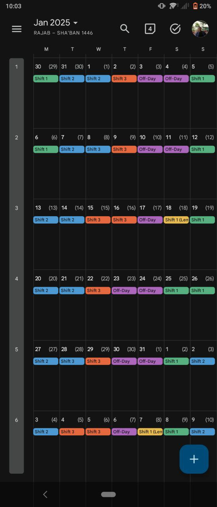
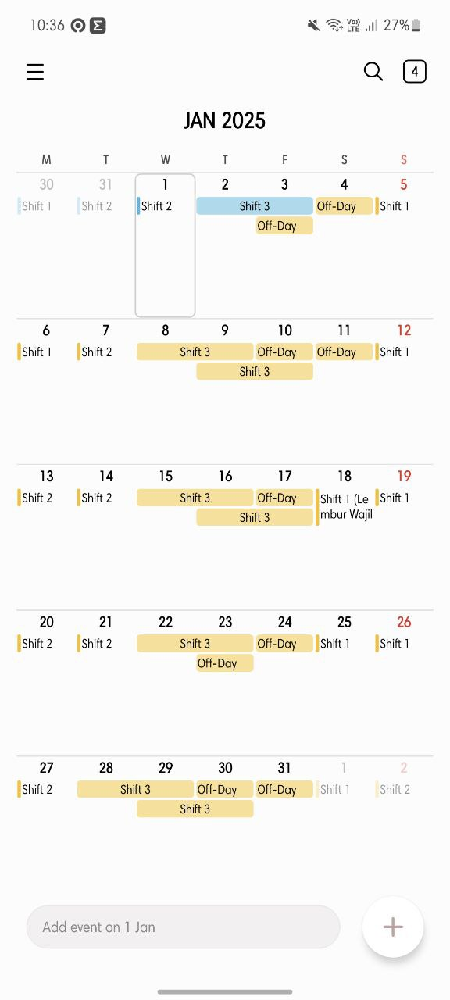
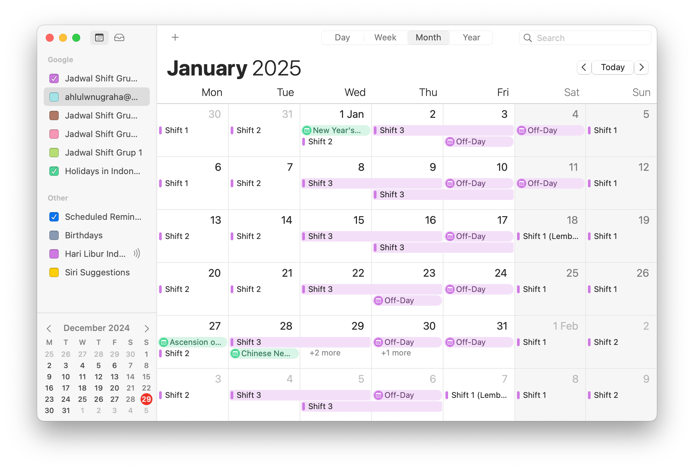

# Shift-Schedule
## Overview

The Shift Schedule is designed to simplify the process of managing and tracking shift schedules for teams and groups. This platform allows for the easy creation, distribution, and monitoring of schedules, ensuring smooth coordination among team members. It integrates seamlessly with Google Calendar (and other calendar services), providing convenient access and visibility to team members.

## Features

- **Shift Schedule Creation**: Easily create shift schedules for your team members.
- **Integration with Google Calendar**: Automatically sync shift schedules with Google Calendar for easy access and visibility.
- **Distribution**: Effortlessly share schedules with team members.
- **Tracking**: Monitor shifts and track changes in real-time.
- **Customization**: Tailor shift schedules to meet your team’s specific needs and preferences. By default, reminders are only enabled for off-days, but you can adjust these settings as needed.

## Getting Started

To get started with the Shift Schedule OC3, follow these steps:

1. **Download Google Calendar**: Download Google Calendar from the Play Store (Android) or App Store (iOS). While not mandatory, using Google Calendar is recommended to avoid syncing issues.
2. **Log In to Google Calendar**: Log in to the Google Calendar using your credentials.
3. **Choose Group/Team**: Select your group or team and click the corresponding link below. This will open the Google Calendar app (if installed) and allow you to subscribe to the calendar.
4. **Configure Preferences**: Customize your preferences in the calendar settings as needed.
5. **Sync**: Customize your preferences in the calendar settings as needed.

## Links to Groups

Click the respective links below to subscribe to your group calendar:

-  **Group 1**: [Subscribe Here](https://calendar.google.com/calendar/u/0?cid=YmQ2NTIxZDVmZDg5MmI0MWFmNGZiZDVlNTFiZDYzNWI3YTViMTY3M2QzMjk0MDE3YWNmOTU1MGRiMGVmM2JlOEBncm91cC5jYWxlbmRhci5nb29nbGUuY29t)
-  **Group 2**: [Subscribe Here](https://calendar.google.com/calendar/u/0?cid=MXJzN21rc2puM25iNzVsZGRrcm9mMGpwZTRAZ3JvdXAuY2FsZW5kYXIuZ29vZ2xlLmNvbQ)
-  **Group 3**: [Subscribe Here](https://calendar.google.com/calendar/u/0?cid=MjYzZWE5YjNhYjJmNTVhNDA1NGU1M2VkMDU3YzYzNzdiMmUwZWZkMmU5ODhkZWZjY2E5MTJjZTc0NWI5ZjA2M0Bncm91cC5jYWxlbmRhci5nb29nbGUuY29t)
-  **Group 4**: [Subscribe Here](https://calendar.google.com/calendar/u/0?cid=MjY3YzViZTJlNzk5NTIyNThkM2QyYzg2Yjk2YWFhMjM1YjNhOTYwYjFkNGY0NGNlNmNkZDkwMjliYzc3YzExNUBncm91cC5jYWxlbmRhci5nb29nbGUuY29t)

## Links to .ical Format

If you prefer to download and set up the calendar manually on your device(s), use the links below:

- **Group 1**: [Download Here](https://calendar.google.com/calendar/ical/bd6521d5fd892b41af4fbd5e51bd635b7a5b1673d3294017acf9550db0ef3be8%40group.calendar.google.com/public/basic.ics)
- **Group 2**: [Download Here](https://calendar.google.com/calendar/ical/1rs7mksjn3nb75lddkrof0jpe4%40group.calendar.google.com/public/basic.ics)
- **Group 3**: [Download Here](https://calendar.google.com/calendar/ical/263ea9b3ab2f55a4054e53ed057c6377b2e0efd2e988defcca912ce745b9f063%40group.calendar.google.com/public/basic.ics)
- **Group 4**: [Download Here](https://calendar.google.com/calendar/ical/267c5be2e79952258d3d2c86b96aaa235b3a960b1d4f44ce6cdd9029bc77c115%40group.calendar.google.com/public/basic.ics)

## Tutorials and Screenshots

Check out the following tutorials to help you get started with Group 1:

- Android

- Apple (iOS/iPadOS)
- Windows

  
Screenshots for reference

- 
- 
- 
- Windows
 

## Contributions

Contributions to the Shift Schedule OC3 are welcome! If you encounter any issues or have suggestions for improvements, feel free to submit a pull request or open an issue on GitHub.

## Maintainer

For inquiries or assistance, you can contact the respective maintainers for each group:
- Group 1  dede.saputra.detra@gmail.com
- Group 2 (Me) ahlulwnugraha@gmail.com
- Group 3 anif.irsyad@gmail.com
- Group 4 oc3grup4@gmail.com

## Notes

If you’re feeling lost, simply install Google Calendar, log in, and follow the appropriate group link above to get started.

## License

No need.

---
